<div align="center">

# 🌱 AgriVisionAI

### Climate-Resilient Farming with AI

**“See the crop. Understand the risk. Make a better decision.”**

<br>

[](https://reactjs.org/)
[](https://www.typescriptlang.org/)
[](https://vitejs.dev/)
[](https://tailwindcss.com/)
[](LICENSE)
[](https://vercel.com/)

<br>

[🌐 **Live Website**](https://vercel.com) &nbsp;•&nbsp;
[💻 **GitHub Repository**](https://github.com/dk-khandelwal06/agrivision-ai) &nbsp;•&nbsp;
[📊 **Pitch Deck**](#-pitch-deck) &nbsp;•&nbsp;
[🚀 **Explore Demo**](#-demo-experience)

<br>

> *🌐 Live Website: `[ADD VERCEL URL HERE]`*  
> *💻 GitHub Repository: `[ADD GITHUB REPOSITORY URL HERE]`*

</div>

---

## 📖 Table of Contents

1. [Executive Summary](#-executive-summary)
2. [The Problem](#-the-problem)
3. [The Solution](#-the-solution)
4. [Key Product Features](#-key-features)
5. [Interactive Farm Onboarding](#-interactive-farm-onboarding)
6. [How AgriVisionAI Works](#-how-agrivisionai-works)
7. [Product Architecture](#-architecture)
8. [Tech Stack](#-tech-stack)
9. [Project Structure](#-project-structure)
10. [📊 Pitch Deck](#-pitch-deck)
11. [Demo Experience](#-demo-experience)
12. [AI Intelligence Layer](#-ai-intelligence)
13. [Responsible AI & Safety](#-responsible-ai--safety)
14. [Roadmap & Vision](#-roadmap)
15. [Business Model & Impact](#-business--impact)
16. [Getting Started](#-getting-started)
17. [Environment Variables](#-environment-variables)
18. [Deployment](#-deployment)
19. [🏆 Hackathon Context](#-hackathon-context)
20. [👥 Team](#-team)
21. [📄 License](#-license)

---

## 🌟 Executive Summary

**AgriVisionAI** is an AI-powered smart farming advisor designed to make smallholder agriculture climate-resilient. Rather than serving as an isolated leaf disease classifier or generic weather dashboard, AgriVisionAI operates on an integrated agronomic philosophy:

$$\text{SEE} \longrightarrow \text{UNDERSTAND} \longrightarrow \text{COMMUNICATE} \longrightarrow \text{ACT}$$

Smallholder farmers (who comprise **86.2%** of Indian agricultural holdings) face volatile weather, accelerating fungal/viral outbreaks, and severely delayed extension advice. AgriVisionAI bridges this gap by reading crop foliar imagery, synthesizing hyper-local meteorological data (temperature, humidity, rain probability) with active crop growth stages, communicating in the farmer's native language (voice and text), and delivering **one clear, prioritized next best action**.

---

## 🌾 The Problem

<div align="center">

> *"Farming decisions are getting harder — not easier."*

</div>

```
┌──────────────────────────────────────┐     ┌──────────────────────────────────────┐
│  ⛈️ Unpredictable Weather & Water    │     │  🐛 Fast-Spreading Pests & Diseases  │
│  Erratic rainfall makes irrigation   │     │  Foliar blights & viruses can destroy│
│  and sowing timing a high-risk gamble│     │  40–80% of yield before discovery    │
└──────────────────────────────────────┘     └──────────────────────────────────────┘
                   ▲                                            ▲
                   │                                            │
                   └───────────────────┬────────────────────────┘
                                       │
                    ┌──────────────────┴───────────────────┐
                    │  ⏳ Delayed Agronomic Expert Advice  │
                    │  Extension services are understaffed │
                    │  and rarely in the farmer's language │
                    └──────────────────────────────────────┘
```

- **86.2% of Indian Farmers** hold less than 2 hectares of land (*Agriculture Census 2015–16, Govt. of India*). They operate with virtually zero margin for crop failure or wasted input capital.
- **Climate Volatility**: Unseasonal rainfall immediately washes away chemical foliar sprays, wasting thousands of rupees in chemical inputs.
- **Cognitive Overload**: Existing platforms present farmers with 20-bullet scientific articles rather than a single, decisive step to take within the next 24 hours.

---

## 💡 The Solution

An AI agronomist that understands **the crop**, **the context**, and **the farmer**.

```
  ┌─────────────┐       ┌─────────────────┐       ┌─────────────────┐       ┌─────────────────┐
  │   01. SEE   │  ──►  │ 02. UNDERSTAND  │  ──►  │ 03. COMMUNICATE │  ──►  │     04. ACT     │
  └─────────────┘       └─────────────────┘       └─────────────────┘       └─────────────────┘
   Computer Vision        Weather + Stage           Multilingual Voice        One Prioritized
   Reads the Crop        Climate Context            & Text LLM                 Next Best Action
```

1. **SEE (Computer Vision)**: Reads crop leaves to identify foliar lesions, chlorosis, and viral curling.
2. **UNDERSTAND (Context Intelligence)**: Synthesizes the visual symptom with hyper-local weather (humidity, temperature, rain forecast) and crop growth stage.
3. **COMMUNICATE (Multilingual AI)**: Explains the diagnosis and reasoning in natural conversational Hindi or English using voice or text.
4. **ACT (Decision Engine)**: Eliminates guesswork by prioritizing **one next best action** (e.g., *"Prune lower foliage and postpone irrigation for 36 hours"*).

---

## 🚜 Key Features

### 🌱 Crop Leaf Scanner (*"Core WOW Moment"*)
- **Multi-Modal Input**: Supports file upload (drag & drop), live device camera capture, and **Instant Pitch Presets** (*Tomato Early Blight, Cotton Leaf Curl, Rice Blast, Wheat Rust, Healthy Corn*).
- **4-Stage Animated Pipeline**: Visually executes *Reading Leaf* → *Checking Jaipur Climate* → *Pathogen Incubation Risk* → *Synthesizing Next Action*.
- **Comprehensive Diagnosis**: Confidence score, severity level, observed leaf indicators, climate context factor, and a highlighted **One Next Best Action**.

### 🤖 AI Farm Advisor
- **Context-Aware Dialogue**: Agronomist chat that automatically loads the farmer's crop variety, growth stage, soil moisture, and active weather forecast into the reasoning loop.
- **Voice & Speech Integration**: Web Speech API speech-to-text recognition with audio playback.
- **Vernacular Language Support**: Seamless bilingual toggle between English and **हिन्दी (Hindi)**.
- **Quick Question Chips**: Pre-built agronomic prompts (*"When should I irrigate?"*, *"Can I spray before the rain?"*, *"Why are leaves turning yellow?"*).

### ⚡ "Farm Intelligence" Center
- **Single-State Farm Health**: Displays holistic health index (`GOOD` 🟢, `WATCH` 🟡, `ATTENTION` 🔴).
- **Contextual "Why?" Explainer**: Translates complex environmental triggers into plain language.
- **One Next Best Action Tracker**: Interactive **[Mark as Completed]** button that triggers celebratory particle confetti and updates cumulative farm resilience.

### ⛅ Hyper-Local Weather & Spray Intelligence
- **Agricultural Spraying Window**: Evaluates rain probability and wind drift to warn farmers when spraying will result in chemical wash-off.
- **Smart Irrigation Advisory**: Computes estimated water savings (~3,200L/acre) by correlating upcoming rainfall with soil moisture.
- **7-Day Agronomic Forecast**: Day-by-day meteorological forecast paired with practical farming implications.

### 📜 Farm Companion Timeline
- **Chronological Crop Health Feed**: Logs scans, climate shifts, pathogen warnings, and verified farmer actions.
- **Custom Action Logging**: Modal allowing farmers to log field interventions and build a persistent farm history.

### 👤 Farm Profile & Demo Controls
- **Granular Management**: Tracks farmer identity, acreage, coordinates, crop stage, irrigation infrastructure, and soil texture.
- **One-Click Demo Reset**: Instantly resets telemetry and scans back to Ramesh Kumar's baseline for pitch demonstrations.

---

## 🌱 Interactive Farm Onboarding

AgriVisionAI features a **split-screen keystroke-reactive signup experience** where the left-side agricultural environment visually adapts as the user interacts with the form:

```
┌───────────────────────────────────────┬───────────────────────────────────────┐
│  🌾 LIVING AGRICULTURAL CANVAS        │  📝 SLEEK SIGNUP FORM                 │
│                                       │                                       │
│  • Farmer Name entered                │  • Farmer / Farm Name                 │
│    └► Profile badge blooms instantly  │                                       │
│  • Location / District selected       │  • District (Jaipur, Indore, etc.)    │
│    └► Pinpoint moves on climate grid  │                                       │
│  • Primary Crop chosen                │  • Primary Crop (Tomato, Cotton, etc.)│
│    └► Foliage illustration morphs     │                                       │
│  • Password typed                     │  • Secure Password                    │
│    └► Root depth & security progress  │                                       │
│                                       │  • [Continue to Farm Profile]         │
└───────────────────────────────────────┴───────────────────────────────────────┘
```

Following signup, a **3-step progressive onboarding wizard** captures:
1. **Farmer Identity & Location**: Name, district, state, preferred language.
2. **Farm & Crop Profile**: Acreage (with automatic Hectare conversion) and hybrid variety.
3. **Agronomic Operations**: Growth stage (*Germination, Vegetative, Flowering, Fruiting, Harvesting*), irrigation method (*Drip, Flood, Sprinkler, Rainfed*), and soil texture.

---

## 🔄 How AgriVisionAI Works

```
┌──────────────┐     ┌──────────────┐     ┌──────────────┐     ┌──────────────┐
│ 1. Enter     │ ──► │ 2. Profile   │ ──► │ 3. Telemetry │ ──► │ 4. Scan      │
│ Landing/Demo │     │ Onboarding   │     │ & Weather    │     │ Crop Leaf    │
└──────────────┘     └──────────────┘     └──────────────┘     └──────────────┘
                                                                      │
┌──────────────┐     ┌──────────────┐     ┌──────────────┐            ▼
│ 8. Timeline  │ ◄── │ 7. Ask AI    │ ◄── │ 6. Execute   │ ◄── ┌──────────────┐
│ Health Log   │     │ Agronomist   │     │ Next Action  │     │ 5. Context   │
└──────────────┘     └──────────────┘     └──────────────┘     │ Diagnosis    │
                                                               └──────────────┘
```

1. **Access**: Farmer lands on the public site or clicks **[Explore Demo Farm]**.
2. **Context Setup**: The system loads the farm's location (e.g., *Jaipur, Rajasthan*), primary crop (*Tomato*), and growth stage (*Flowering*).
3. **Foliar Scanning**: Farmer uploads a leaf photo or selects a field sample.
4. **4-Stage Inference**: The service extracts lesion patterns, correlates ambient humidity (68%) and impending rain, scores pathogen risk, and determines the priority action.
5. **Decisive Guidance**: Farmer receives **one next best action** (*"Prune lower foliage and postpone irrigation for 24h"*).
6. **Conversational Support**: Farmer asks follow-up questions in Hindi or English using voice or text.
7. **Action Verification**: Farmer marks the action complete, raising the farm resilience score and logging it to the health timeline.

---

## 🏗️ Architecture

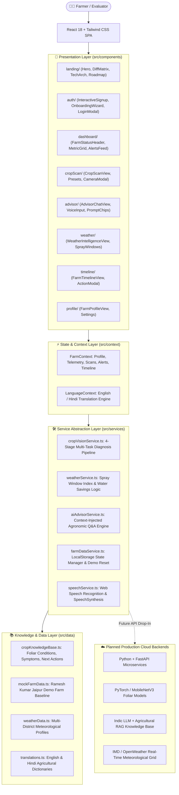

---

## 🛠️ Tech Stack

| Layer | Technology | Purpose in AgriVisionAI | Status |
|---|---|---|---|
| **Frontend Framework** | React 18.3.1 | Component-driven user interface and state management | ✅ Implemented |
| **Language** | TypeScript 5.6.3 | Strict type definitions across farm profiles, telemetry, and diagnostics | ✅ Implemented |
| **Build Tool** | Vite 5.4.14 | Sub-second HMR development server and optimized rollup bundling | ✅ Implemented |
| **Styling** | Tailwind CSS 3.4.17 | Custom agricultural design system (Forest green `#123326`, cream `#fdfcf9`, clay `#d97736`) | ✅ Implemented |
| **Icons** | Lucide React 0.475.0 | Consistent modern iconography | ✅ Implemented |
| **Charts** | Recharts 2.15.1 | Telemetry curves and agricultural data visualization | ✅ Implemented |
| **Animations & Confetti** | Canvas Confetti 1.9.4 | Interactive action completion reward mechanism | ✅ Implemented |
| **Speech Audio** | Web Speech API | Native speech-to-text recognition and text-to-speech synthesis | ✅ Implemented |
| **State Persistence** | LocalStorage API | Zero-backend client-side persistence for custom farm onboarding | ✅ Implemented |
| **Deployment** | Vercel SPA Configuration | Clean client-side routing via `vercel.json` | ✅ Implemented |
| **Backend API (Planned)** | Python + FastAPI | Production microservices for deep learning inference | ⏳ Planned Integration |
| **Vision Model (Planned)** | PyTorch / MobileNetV3 | Edge-optimized CNN for on-device foliar classification | ⏳ Planned Integration |
| **Language Model (Planned)** | Indic LLM + RAG | Cloud LLM augmented with ICAR & KVK package of practices | ⏳ Planned Integration |

---

## 📁 Project Structure

```
AgriVision AI/
├── index.html                     # Entry HTML, Google Fonts (Outfit, Inter), SEO metadata
├── package.json                   # Dependencies, TypeScript, Vite, Tailwind CSS configs
├── tsconfig.json                  # TypeScript compiler options and alias mappings
├── tsconfig.node.json             # TypeScript config for Vite configuration
├── tailwind.config.js             # Custom agricultural palette and animation keyframes
├── postcss.config.js              # PostCSS plugins (Tailwind, Autoprefixer)
├── vercel.json                    # Single-page application route rewrite rules
├── .env.example                   # Environment variable template
├── LICENSE                        # MIT License
├── README.md                      # Comprehensive project documentation
├── slides/                        # Round 1 Pitch Deck Presentation Slides (1–10)
│   ├── Slide1.PNG
│   ├── Slide2.PNG
│   ├── ...
│   └── Slide10.PNG
└── src/
    ├── main.tsx                   # React root mount with Language & Farm Providers
    ├── App.tsx                    # Top-level view router, modal controllers, and layout
    ├── index.css                  # Global Tailwind imports, custom scrollbar, glassmorphism
    ├── types/                     # Strict TypeScript interface definitions
    │   ├── farm.ts                # FarmProfile, FarmTelemetry, AlertItem, TimelineEntry
    │   ├── cropScan.ts            # CropCondition, ScanResult, PresetCropSample, Indicators
    │   ├── weather.ts             # WeatherCurrent, HourlyForecast, DayForecast, Advisories
    │   └── chat.ts                # ChatMessage, SuggestedQuestion
    ├── data/                      # Structured agronomic datasets & presets
    │   ├── mockFarmData.ts        # Ramesh Kumar Jaipur Demo Farm pre-configured state
    │   ├── cropKnowledgeBase.ts   # Curated foliar conditions, symptoms & next actions
    │   ├── weatherData.ts         # Hyper-local weather patterns & agricultural implications
    │   └── translations.ts        # English and Hindi (हिन्दी) translation dictionaries
    ├── services/                  # Clean modular service abstraction layer
    │   ├── cropVisionService.ts   # 4-stage computer vision & context inference pipeline
    │   ├── weatherService.ts      # Spray feasibility & irrigation water savings logic
    │   ├── aiAdvisorService.ts    # Context-injected agronomist Q&A engine
    │   ├── farmDataService.ts     # LocalStorage state management and demo reset helpers
    │   └── speechService.ts       # Web Speech API recognition and synthesis wrapper
    ├── context/                   # React Context state management
    │   ├── FarmContext.tsx        # Farm profile, telemetry scores, active scans, alerts
    │   └── LanguageContext.tsx    # Multilingual state controller and translator helper t()
    └── components/                # Modular UI component system
        ├── common/                # Navbar, Footer, DemoBanner, SafetyDisclaimer
        ├── landing/               # HeroSection, ProblemSection, WorkflowSection, DiffMatrix,
        │                          # TechArchSection, MarketImpactSection, RoadmapSection, CTASection
        ├── auth/                  # InteractiveSignup, LoginModal, OnboardingWizard
        ├── dashboard/             # FarmStatusHeader, MetricOverviewGrid, QuickActionBar,
        │                          # AlertsFeed, RecentScansCard
        ├── cropScan/              # CropScanView (Upload, Camera, Presets, 4-Stage Animation)
        ├── advisor/               # AdvisorChatView (Voice Input, Suggested Prompt Chips)
        ├── weather/               # WeatherIntelligenceView (Spray Window, 7-Day Forecast)
        ├── timeline/              # FarmTimelineView, Action Logger Modal
        └── profile/               # FarmProfileView, Agronomic Parameter Editor
```

---

# 📊 Pitch Deck

The **AgriVisionAI** startup concept was presented at **StartupX Hackathon 2026** across a 10-slide pitch deck. Below is the complete slide-by-slide documentation of the product vision, market thesis, and technology roadmap.

---

### Slide 1 — Title & Positioning

<div align="center">

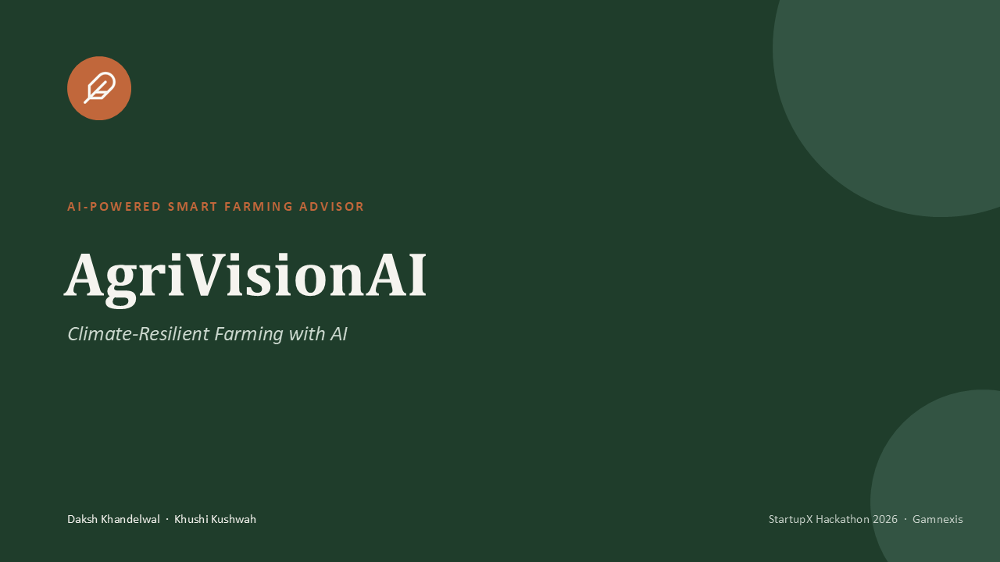

</div>

**What this slide communicates:**  
Introduces **AgriVisionAI** with its core positioning: *"AI-Powered Smart Farming Advisor — Climate-Resilient Farming with AI"*. Presented by **Daksh Khandelwal** and **Khushi Kushwah** at **StartupX Hackathon 2026 · Gamnexis**. Sets the visual identity around deep agricultural greens and warm earth tones.

---

### Slide 2 — The Problem

<div align="center">

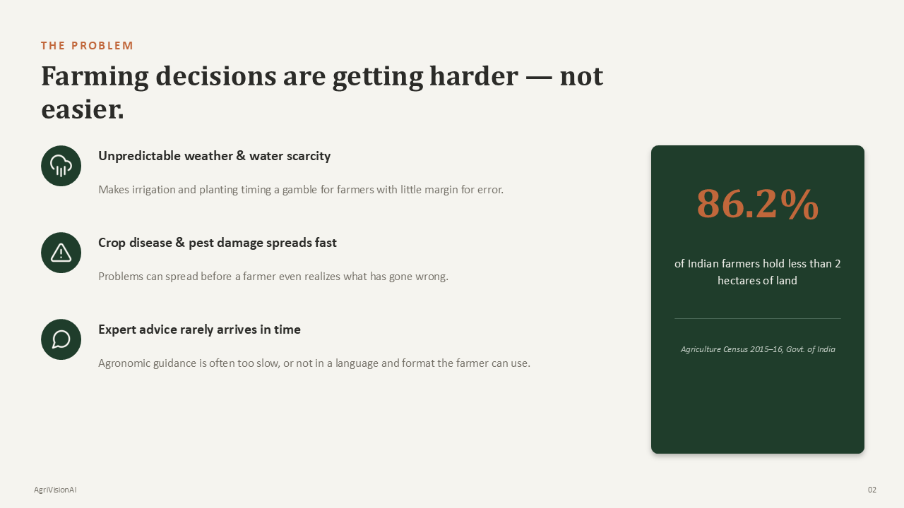

</div>

**What this slide communicates:**  
Establishes that farming decisions are becoming increasingly difficult due to unpredictable weather, rapid crop pathogen spread, and delayed expert advice. Highlights the central demographic insight from the Government of India Agriculture Census: **86.2% of Indian farmers hold less than 2 hectares of land**, meaning they have zero margin for error when climate shocks hit.

---

### Slide 3 — The Solution

<div align="center">

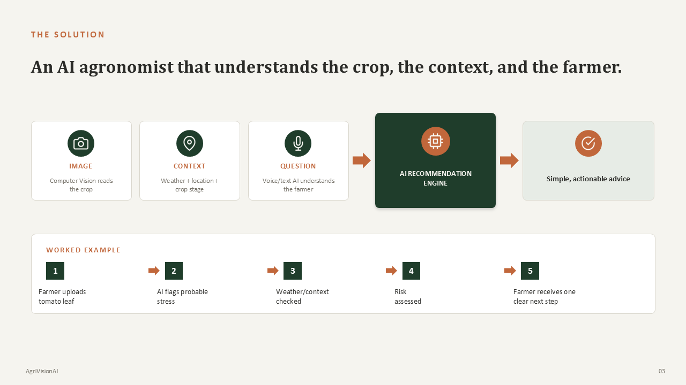

</div>

**What this slide communicates:**  
Defines the AgriVisionAI solution as *"An AI agronomist that understands the crop, the context, and the farmer."* Illustrates the 4-element pipeline combining Image, Context (weather + location + crop stage), and Question (voice/text) into the AI Recommendation Engine. Features a 5-step worked example demonstrating how a tomato leaf upload is correlated with weather to yield a single clear next step.

---

### Slide 4 — Who We Serve

<div align="center">

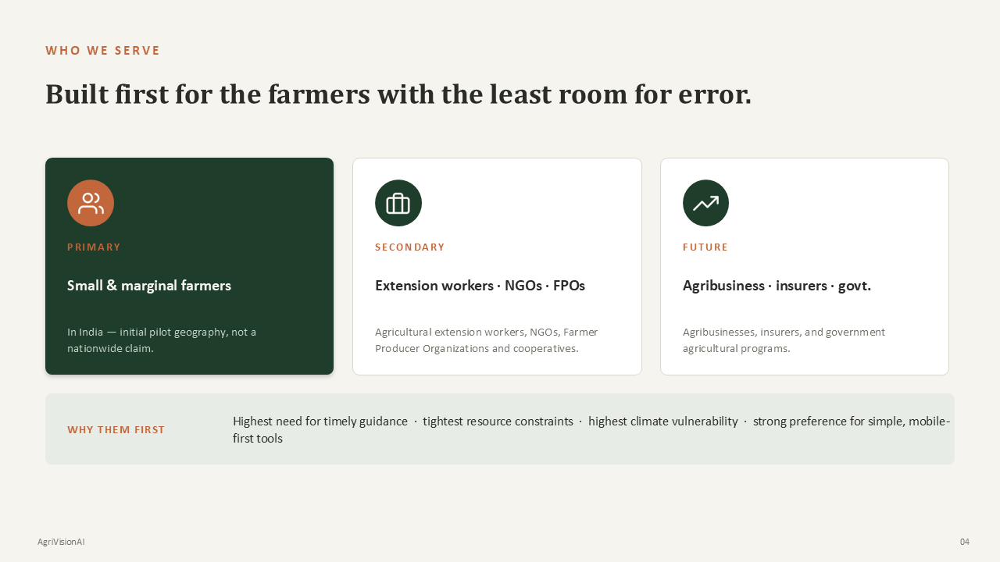

</div>

**What this slide communicates:**  
Articulates the customer segmentation strategy: **Primary target** is small & marginal farmers in India (pilot geography); **Secondary target** encompasses agricultural extension workers, NGOs, and Farmer Producer Organizations (FPOs); **Future target** includes agribusinesses, crop insurers, and government programs. Justifies *"Why them first"* based on highest need, tightest resource constraints, and mobile-first preference.

---

### Slide 5 — Why We're Different

<div align="center">

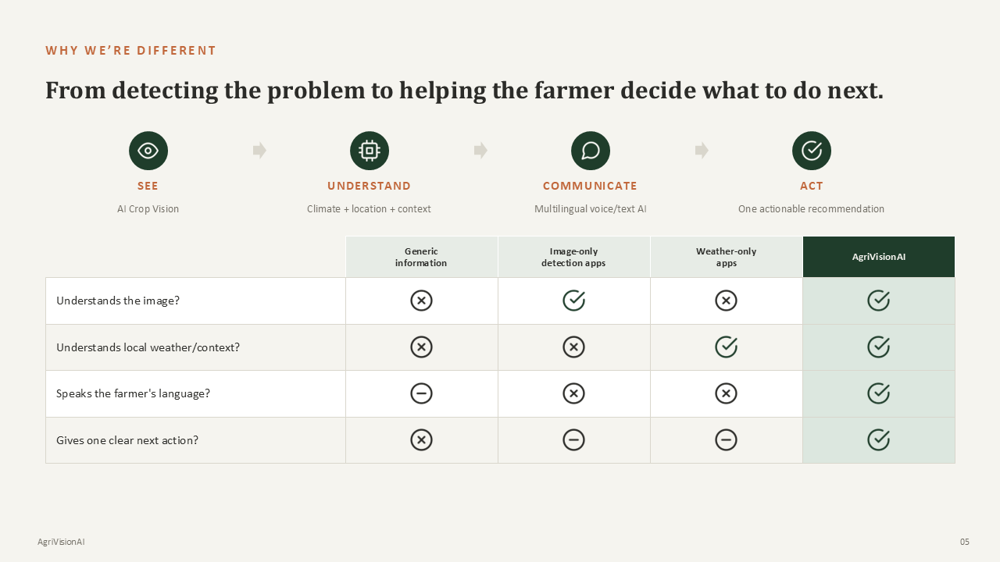

</div>

**What this slide communicates:**  
Presents the **Differentiation Matrix** contrasting Generic Search, Image-only detection apps, Weather-only apps, and AgriVisionAI across four core dimensions: *Understands the image?*, *Understands local weather/context?*, *Speaks the farmer's language?*, and *Gives one clear next action?*. Demonstrates that AgriVisionAI is the only solution delivering 100% end-to-end decision support.

---

### Slide 6 — Market & Opportunity

<div align="center">

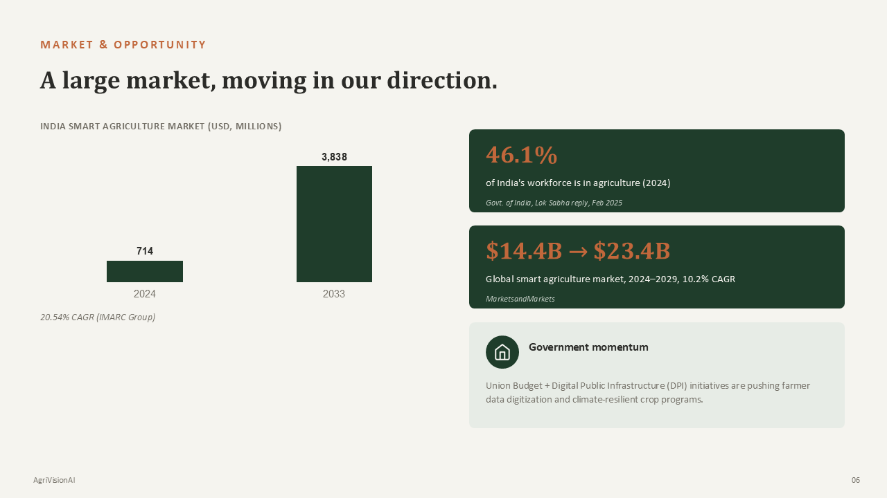

</div>

**What this slide communicates:**  
Validates the macro market opportunity: the India Smart Agriculture market is growing from **$714M (2024)** to **$3,838M (2033)** at **20.54% CAGR** (*IMARC Group*). Notes that **46.1% of India's workforce is in agriculture** (*Govt. of India, Feb 2025*), alongside a global smart agriculture market expanding from **$14.4B to $23.4B**. Emphasizes government momentum in Digital Public Infrastructure (DPI) for farmer data.

---

### Slide 7 — MVP / Product Experience

<div align="center">

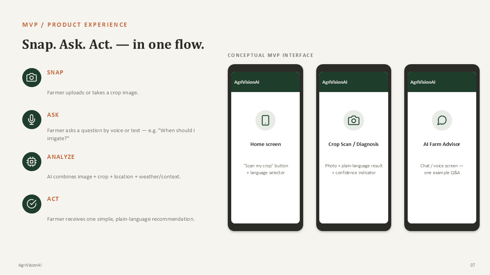

</div>

**What this slide communicates:**  
Outlines the streamlined user flow: **Snap → Ask → Analyze → Act**. Displays conceptual mobile interface mockups showcasing the Home Screen with language selector, the Crop Scan / Diagnosis screen with confidence indicators, and the AI Farm Advisor conversational screen.

---

### Slide 8 — AI / ML Technology Architecture

<div align="center">

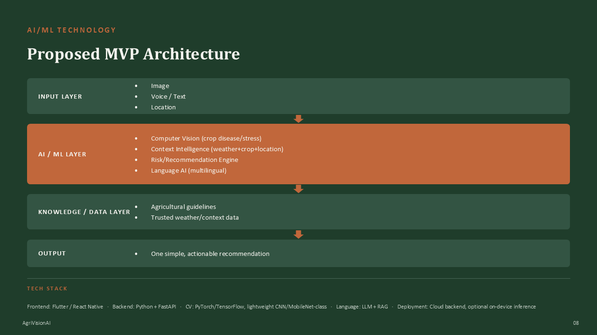

</div>

**What this slide communicates:**  
Details the proposed technical architecture across 4 distinct layers: **Input Layer** (Image, Voice/Text, Location), **AI/ML Layer** (Computer Vision, Context Intelligence, Risk Engine, Multilingual Language AI), **Knowledge/Data Layer** (Agricultural guidelines, trusted weather data), and **Output** (One simple, actionable recommendation). Specifies the target technology stack (React Native/Flutter, Python + FastAPI, PyTorch/MobileNet, LLM + RAG).

---

### Slide 9 — Business Model & Impact

<div align="center">

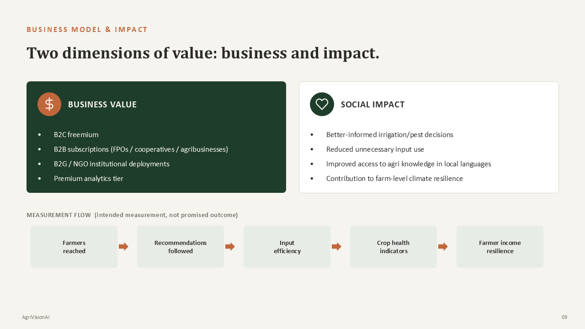

</div>

**What this slide communicates:**  
Presents the twin engines of value: **Business Value** (B2C freemium, B2B FPO/agribusiness subscriptions, B2G/NGO deployments, premium insurance analytics) and **Social Impact** (optimized input use, vernacular access, climate resilience). Illustrates the 5-stage measurement progression: *Farmers reached → Recommendations followed → Input efficiency → Crop health indicators → Farmer income resilience*.

---

### Slide 10 — Roadmap & Vision

<div align="center">

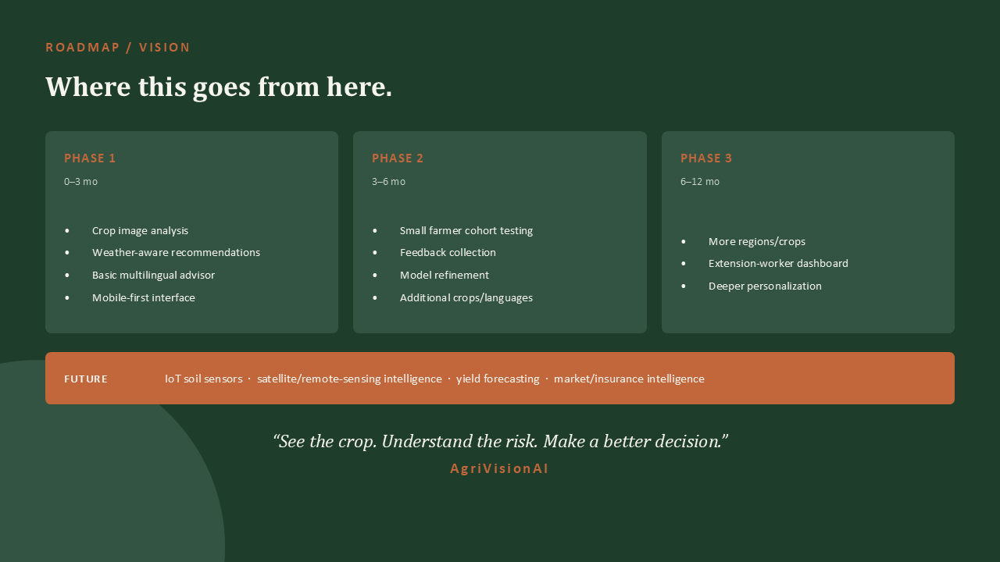

</div>

**What this slide communicates:**  
Maps out the product trajectory across three execution phases: **Phase 1 (0–3 mo)**: MVP foliar analysis, weather-aware recommendations, multilingual advisor; **Phase 2 (3–6 mo)**: Small farmer cohort testing, feedback collection, model refinement; **Phase 3 (6–12 mo)**: Regional expansion, extension worker dashboard; and **Future**: IoT soil sensors, satellite remote sensing, yield forecasting, and parametric crop insurance.

---

## 🎬 Demo Experience

For hackathon judges, investors, and agricultural partners, AgriVisionAI includes a **pre-configured 30-second live demonstration mode**:

```
Landing Page
   │
   ▼  Click [Explore Live Demo Farm]
Demo Farm Dashboard (Ramesh Kumar · Jaipur Tomato Farm · 1.8 Ha · Flowering Stage)
   │
   ▼  Review Status: WATCH (68% Humidity + Early Blight Spot)
Click [Mark as Completed] on "Your One Next Best Action"
   │
   ▼  Watch Confetti Celebration & Farm Resilience Score Rise to 86%
Click [Scan Crop] in Quick Actions
   │
   ▼  Select Preset: "Tomato (Early Blight)" & Click [Analyze Crop Health & Context]
Watch 4-Stage Multi-Task Pipeline Animation
   │
   ▼  Receive Diagnosis & Contextual Spray Window
Click [Ask AI Advisor About This Result]
   │
   ▼  Voice/Text Conversational Agronomist (Toggle to हिन्दी for Vernacular Demo)
Review Weather Intelligence (Spray Window & Smart Irrigation Water Savings)
```

---

## 🧠 AI Intelligence

```
┌───────────────────────────────────────────────────────────────────────────────┐
│                        AI AGRONOMIC REASONING LOOP                            │
│                                                                               │
│   Foliar Visual Features        Micro-Climate Context       Crop Phenology    │
│  (Lesions, Chlorosis, Halo)  +  (Temp, Humidity, Rain)  +  (Flowering Stage)  │
│                                       │                                       │
│                                       ▼                                       │
│                        Pathogen Incubation Risk Score                         │
│                                       │                                       │
│                                       ▼                                       │
│                  ONE PRIORITIZED NEXT BEST ACTION (ACT)                       │
└───────────────────────────────────────────────────────────────────────────────┘
```

### Current MVP Implementation (Client-Side Modular Services)
- **`cropVisionService.ts`**: Simulates the multi-stage inference pipeline (*feature extraction → weather correlation → pathogen propagation risk → action formulation*) with realistic latency and pre-calibrated botanical diagnostic profiles.
- **`aiAdvisorService.ts`**: Context-injected conversational engine that structures agronomic reasoning based on active crop stage, weather telemetry, and recent diagnostic scans. Supports English and Hindi translations.
- **`weatherService.ts`**: Computes agricultural spray feasibility based on precipitation probabilities and wind drift, calculating water savings from delayed irrigation.
- **`speechService.ts`**: Interfaces with browser `SpeechRecognition` and `SpeechSynthesis` Web APIs.

### Planned Production AI Integration
- **Computer Vision**: Deployment of lightweight PyTorch / MobileNetV3 convolutional neural networks optimized for on-device inference on low-bandwidth rural mobile devices.
- **Language & RAG**: Integration of fine-tuned open-source Indic LLMs augmented with vector retrieval over official **ICAR** (*Indian Council of Agricultural Research*) and **KVK** package-of-practices guidelines.
- **Meteorology**: Automated ingestion of hyper-local gridded weather data via the **IMD** (*India Meteorological Department*) and satellite APIs.

---

## 🛡️ Responsible AI & Safety

Agricultural advisory decisions directly impact farmer livelihoods and food security. Therefore, AgriVisionAI enforces strict responsible AI guidelines:

- **No Absolute Assertions**: Diagnoses are presented with explicit confidence ratings (e.g., *91% Match*) and probabilistic phrasing (*"Possible issue"*, *"Contextual risk factor"*).
- **Dosage Precautions**: All chemical and biological recommendations emphasize precise dilution ratios and include specific negative warnings (*"Do NOT apply nitrogen fertilizers while lesions are active"*).
- **Statutory Advisory Disclaimer**: Every diagnostic card and dashboard view incorporates clear disclaimers that AgriVisionAI serves as contextual decision support and does not replace statutory local Krishi Vigyan Kendra (KVK) agricultural officers.

---

## 🗺️ Roadmap

```
  PHASE 1 (0–3 Months)       PHASE 2 (3–6 Months)       PHASE 3 (6–12 Months)            FUTURE
 ──────────────────────     ──────────────────────     ──────────────────────     ──────────────────────
 • Crop image analysis      • Farmer cohort trials     • Extension worker hub     • IoT soil sensors
 • Weather-aware advice     • Model fine-tuning        • Enterprise FPO clusters  • Satellite NDVI feeds
 • English & Hindi voice    • 8 additional crops       • State agri integrations  • Yield forecasting
 • Mobile-first web app     • Marathi & Punjabi        • Multi-plot analytics     • Parametric insurance
```

- **Phase 1 (Current MVP)**: Core foliar computer vision pipeline, hyper-local weather correlation, bilingual AI agronomist, and mobile-responsive farmer interface.
- **Phase 2 (Cohort Trials)**: Pilot field deployments across semi-arid zones in Rajasthan and Madhya Pradesh, real-world accuracy benchmarking, and addition of regional commercial crops.
- **Phase 3 (Institutional Hub)**: Dedicated cluster dashboards for FPO managers and agricultural extension officers.
- **Long-Term Horizon**: Automated ingestion of multispectral satellite imagery (Sentinel-2 NDVI), IoT ground moisture probes, and yield forecasting algorithms.

---

## 🌍 Business & Impact

### Business Model
- **B2C Freemium**: Free access to core leaf scanning and basic weather advisories; subscription tier for unlimited multilingual voice consultations and customized farm telemetry.
- **B2B Subscriptions**: Enterprise management tools for Farmer Producer Organizations (FPOs), cooperatives, and agricultural input distributors to monitor member crop health.
- **B2G & Institutional Deployments**: Public health, extension, and climate adaptation deployments in partnership with state agricultural agencies and NGOs.
- **Anonymized Data Analytics**: Macro-level crop stress and pathogen outbreak indices for agricultural insurers and supply chain planners.

### Intended Social Impact Flow

$$\text{Farmers Reached} \longrightarrow \text{Recommendations Followed} \longrightarrow \text{Input Efficiency} \longrightarrow \text{Crop Health Protected} \longrightarrow \text{Income Resilience}$$

- **Reduced Input Overuse**: Preventing unseasonal chemical spraying saves smallholders thousands of rupees in lost inputs.
- **Water Conservation**: Smart irrigation deferral saves an estimated 3,200 liters of groundwater per acre per rain event.
- **Linguistic Inclusivity**: Eliminates language barriers by delivering expert agronomic guidance in regional Indic dialects.

---

## 💻 Getting Started

### Prerequisites
- [Node.js](https://nodejs.org/) (version 18.0.0 or higher recommended)
- `npm` (version 9.0.0 or higher)

### Installation & Local Setup

```bash
# 1. Clone the repository
git clone https://github.com/dk-khandelwal06/agrivision-ai.git

# 2. Navigate to the project root
cd agrivision-ai

# 3. Install all dependencies
npm install

# 4. Start the local development server
npm run dev
```

Open your browser and navigate to **`http://localhost:5173/`**.

### Available Scripts

| Command | Description |
|---|---|
| `npm run dev` | Starts the Vite development server with Hot Module Replacement (HMR) |
| `npm run build` | Compiles TypeScript (`tsc`) and generates optimized production bundle in `dist/` |
| `npm run preview` | Locally previews the production build generated in `dist/` |

---

## 🔐 Environment Variables

The application works out of the box in standalone client-side demo mode. To connect future production backend endpoints or weather APIs, copy the example file:

```bash
cp .env.example .env
```

| Variable | Description | Default / Example | Required |
|---|---|---|---|
| `VITE_APP_TITLE` | Application Title | `AgriVisionAI` | Optional |
| `VITE_ENABLE_LIVE_WEATHER` | Toggle live meteorological API | `false` | Optional |
| `VITE_WEATHER_API_KEY` | Weather provider API key | `""` | Optional |
| `VITE_ENABLE_AI_BACKEND` | Toggle cloud AI microservices | `false` | Optional |
| `VITE_AI_BACKEND_URL` | Cloud FastAPI backend endpoint | `""` | Optional |

> ⚠️ **Security Notice**: Never commit real API keys or credentials to version control.

---

## 🚀 Deployment

The project is pre-configured for zero-configuration deployment to **Vercel**.

### Deploying via Vercel Dashboard

1. Push your code to a GitHub or GitLab repository.
2. Go to [Vercel](https://vercel.com) and click **"Add New Project"**.
3. Import the `agrivision-ai` repository.
4. Set the project configuration:
   - **Framework Preset**: `Vite`
   - **Build Command**: `npm run build`
   - **Output Directory**: `dist`
5. Click **Deploy**.

Single-page application client routing is handled automatically by the included [`vercel.json`](vercel.json):

```json
{
  "rewrites": [
    {
      "source": "/(.*)",
      "destination": "/index.html"
    }
  ]
}
```

---

## 🏆 Hackathon Context

**AgriVisionAI** was conceived, designed, and developed for:

**StartupX Hackathon 2026**  
*Organized by **Gamnexis***

The prototype demonstrates how modern web engineering, responsive AI UX, and agronomic context intelligence can democratize precision agriculture for small and marginal farmers across India.

---

## 👥 Team

<div align="center">

### Daksh Khandelwal

**2nd Year · B.S. in AI & Data Science · IIT Jodhpur**

📧 **Email:** [dk.khandelwaliit@gmail.com](mailto:dk.khandelwaliit@gmail.com)

💼 **LinkedIn:** [linkedin.com/in/daksh-khandelwal](https://www.linkedin.com/in/daksh-khandelwal-b02748391/)

💻 **GitHub:** [@dk-khandelwal06](https://github.com/dk-khandelwal06)

<br>

### Khushi Kushwah

**2nd Year · B.S. in AI & Data Science · IIT Jodhpur**

📧 **Email:** [khushikushwah213@gmail.com](mailto:khushikushwah213@gmail.com)

💻 **GitHub:** [@khushikushwah213](https://github.com/khushikushwah213)

</div>

---

## 📄 License

This project is licensed under the **MIT License** — see the [LICENSE](LICENSE) file for details.

```text
MIT License
Copyright (c) 2026 Daksh Khandelwal and Khushi Kushwah
```

---

<div align="center">

### 🌱 AgriVisionAI

**See the crop. Understand the risk. Make a better decision.**

*Built with AI for more informed, climate-resilient farming.*

</div>
